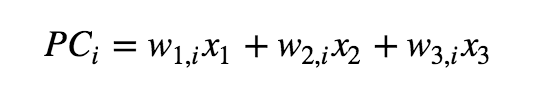
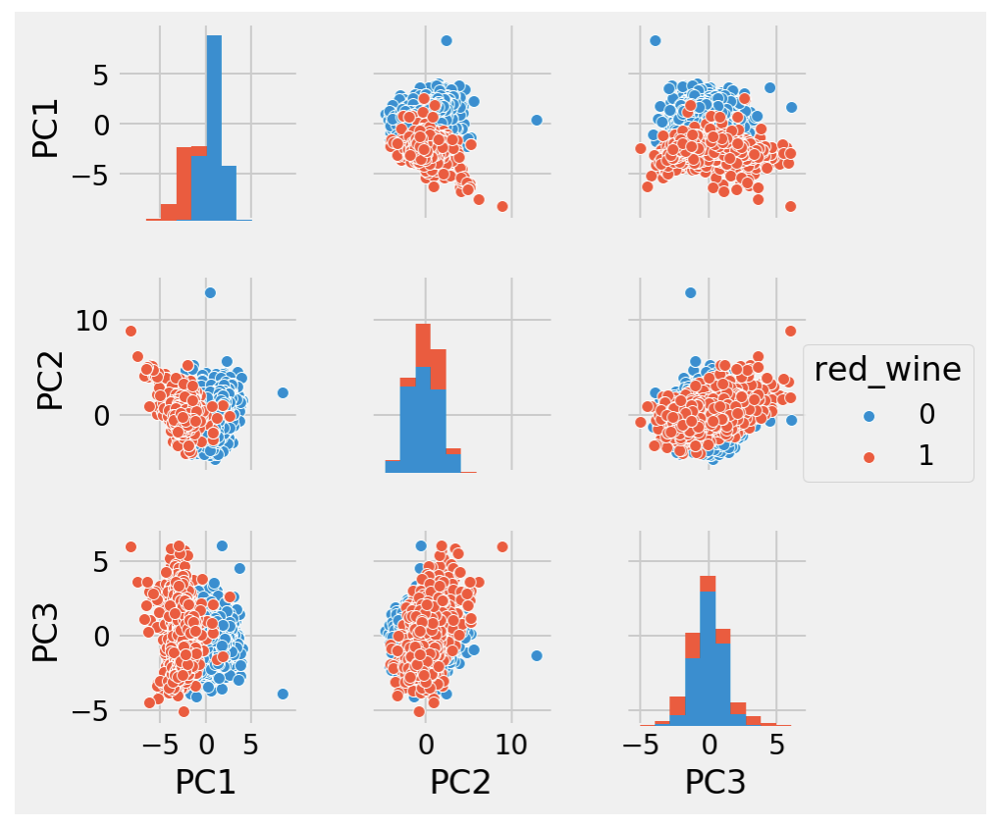

## Principal Component Analysis (PCA) [[view code]]( https://github.com/rjwizecom/unsupervised_machine_learning/blob/main/pca/notebooks/pca_wines.ipynb) 
    

**The code is available [here]( https://github.com/rjwizecom/unsupervised_machine_learning/blob/main/pca/notebooks/pca_wines.ipynb) **

<p align="center">
  <a href="#intro"> Introduction </a> •
  <a href="#goal"> Goal </a> •
  <a href="#eig"> Component weights with corresponding variables for the PCs </a> 
</p> 


<a id = 'expvar'></a>
<a id = 'intro'></a>
### Introduction

Principle Component Analysis or PCA is the best known dimensionality reduction algorithm. It combines existing features into fewer ones. Its goals are mainly:
- To transform original features "high-performance" ones
- To reduce the data dimensionality until you are left with the most relevant ones
- Remove multicollinearities

PCA is essentially a coordinate transformation where the original axes are features and the new axes (the new coordinate system for the data) are the *principal components*.

Let us consider the following example. Suppose my goal is to predict $y$ from the features $x_i$ with $i=1,2,3$. Since this is 3D data it is likely that multicollinearity is present. 

Applying PCA we will obtain "super-predictor variables" called *components*. These are linear combinations of predictors that generate new *principal components* and the latter explain the maximum possible amount of variance in the predictors:

<br/>
<p align="center">
  
</p>
where i=1,2,3. These principal components are uncorrelated. The new axes of principal components are the most concise descriptors of our data. More concretely, each consecutive direction aims at maximizing the remaining variance and each direction is orthogonal to the others

The total variance of your data gets redistributed among the principal components and most variance is captured in the first principal components and the noise is isolated to last principal compoments. Furthermore, there is no covariance between the principal components.

<a id = 'goal'></a>
### Goal

I will apply PCA on a wine dataset.

<a id = 'imp'></a>
### Component weights with corresponding variables for the PCs
We now print out the weights (eigenvectors) with their corresponding variables. For that we use `.components_`. 

> These are the principal axes in feature space, representing the directions of maximum variance in the data. 

For example:

```
for i in range(0,2):
    for col, comp in zip(wc.columns, wpca.components_[i]):
        print(col,':',round(comp,3))
    print('')
```
The output is:
```
fixed acidity : -0.26
volatile acidity : -0.39
citric acid : 0.15
residual sugar : 0.32
chlorides : -0.31
free sulfur dioxide : 0.42
total sulfur dioxide : 0.47
density : -0.09
pH : -0.21
sulphates : -0.3
alcohol : -0.06
quality : 0.09

fixed acidity : 0.26
volatile acidity : 0.11
citric acid : 0.14
residual sugar : 0.34
chlorides : 0.27
free sulfur dioxide : 0.11
total sulfur dioxide : 0.14
density : 0.55
pH : -0.15
sulphates : 0.12
alcohol : -0.49
quality : -0.3
```
We can check if the first three components are able to differentiate red from white wines using pairplots:

```
sns.pairplot(data=wpcs, vars=['PC1','PC2','PC3'], hue='red_wine', size=2)
```
<br/>
<p align="center">
  
</p>
